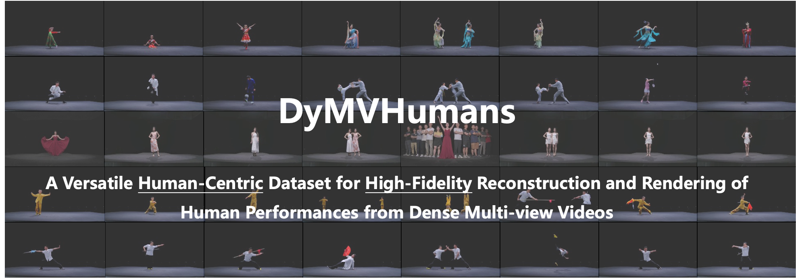
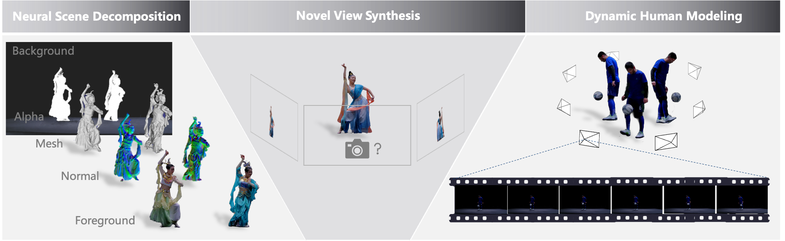
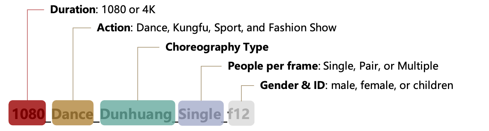

<h1 align="center">PKU-DyMVHumans: A Multi-View Video Benchmark for High-Fidelity Dynamic Human Modeling</h1>

<br />

<div align="center">
    
[Xiaoyun Zheng](https://github.com/zhengxyun)<sup>1,2</sup>, [Weili Liao](https://github.com/leviome)<sup>1,2</sup>, Xufeng Li<sup>3</sup>, 

[Jianbo Jiao](https://jianbojiao.com/)<sup>4</sup>, [Rongjie Wang](https://github.com/rongjiewang)<sup>2</sup>, 
[Feng Gao](https://www.art.pku.edu.cn/szdw/qzjs/cysjyysglx/gf/index.htm)<sup>1</sup>, [Shiqi Wang](https://www.cs.cityu.edu.hk/~shiqwang)<sup>3</sup>, 
[Ronggang Wang](https://www.ece.pku.edu.cn/info/1046/2147.htm)<sup>1*</sup>

<p><sup>1</sup> Peking University &nbsp;&nbsp;<sup>2</sup>Peng Cheng Laboratory &nbsp;&nbsp;<sup>3</sup>City University of Hong Kong &nbsp;&nbsp;<sup>4</sup>University of Birmingham
<br><sup>*</sup>Corresponding author &nbsp;&nbsp<p>

### [Project page](https://pku-dymvhumans.github.io/) · [Paper](https://arxiv.org) 

<br />

</div>



## Overview

PKU-DyMVHumans is a versatile human-centric dataset designed for high-fidelity reconstruction and rendering of dynamic human performances in markerless multi-view capture settings. It comprises 32 humans across 45 different dynamic scenarios, each featuring highly detailed appearances and complex human motions. 

Inspired by recent advancements in neural radiance field (NeRF)-based scene representations, we carefully set up an off-the-shelf framework that is easy to provide those state-of-the-art NeRF-based implementations and benchmark on PKU-DyMVHumans dataset. This includes neural scene decomposition, 3D human reconstruction, and novel view synthesis of dynamic scenes.




## Usage

### Download Instructions

The dataset can be directly downloaded from the following links.

**Part1**: [Baidu Pan](https://pan.baidu.com/s/1kquW0zhfOBineQb-Trbnng?pwd=fas1) (code: fas1), (8 scenarios) can be directly used for benchmarks in fine-grained foreground/background decomposition, 3D human reconstruction and novel view synthesis. 

**Part2**: [Baidu Pan](https://pan.baidu.com/s/1dAD6d1sQ5skJHg1OBv2MRA?pwd=3i2p) (code: 3i2p), (37 scenarios) contains video sequences of the dataset.

**Note that by downloading the datasets, you acknowledge that you have read the agreement, understand it, and agree to be bound by them**:

> 1. The PKU-DyMVHumans dataset is made available only for non-commercial research purposes. Any other use, in particular any use for commercial purposes, is prohibited.
>
> 2. You agree not to further copy, publish or distribute any portion of the dataset. 
>
> 3. Peking University reserves the right to terminate your access to the dataset at any time.

### Dataset format

For each scene, we provide the multi-view images (`./case_name/per_view/cam_*/images/`), the coarse foreground with RGBA channels (`./case_name/per_view/cam_*/images/`), as well as the coarse foreground segmentation (`./case_name/per_view/cam_*/pha/`), which are obtained using [BackgroundMattingV2](https://github.com/PeterL1n/BackgroundMattingV2). 

To make the benchmarks easier compare with our dataset, we save different data formats (i.e., [Surface-SOS](https://github.com/zhengxyun/Surface-SOS), [NeuS](https://github.com/Totoro97/NeuS), [NeuS2](https://github.com/19reborn/NeuS2), [Instant-ngp](https://github.com/NVlabs/instant-ngp), and [3D-Gaussian](https://github.com/graphdeco-inria/gaussian-splatting)) of PKU-DyMVHumans at **Part1** and write a document that describes the data process. 


```
.
|--- <case_name>
|   |--- cams                    
|   |--- videos
|   |--- per_view                
|   |--- per_frame              
|   |--- data_ngp       
|   |--- data_NeuS
|   |--- data_NeuS2
|   |--- data_COLMAP
|   |--- <overview_fme_*.png>
|--- ...

```

Optionally, camera parameters are provided in `./case_name/cams/`, the `*_cam.txt` files are for example :

```
extrinsic
-0.9870368172239224 -0.022593485597630164 -0.15889573893915476 0.2776553077243575 
0.023645162225597843 0.9587670058488046 -0.28320793562159163 0.6898850210976338 
0.1587426462794277 -0.2832937749126657 -0.9458041072801162 4.304908547693294 
0.0 0.0 0.0 1.0 

intrinsic
1795.4695513117783 0.0 960.0 
0.0 1908.5821699983292 540.0 
0.0 0.0 1.0 

<depth_value1> <depth_value2> <depth_value3> <depth_value4>  # depth range and interval 
```

### Case Naming Rules

To filter the scenarios to be downloaded depending on the purpose, you can take advantage of the format of the case names. The case name contains information regarding the duration, action, scenarios type, peeple per frame, and the gender. For instance,



### Scripts

We provide several scripts in this repo for you to experiment with our dataset. More detailed instructions are included in the files.

* `data_preprocess.sh`: Per view image overview, and save the image sequence and matting results.
* `process2colmap2neus.sh`: process2colmap2neus.sh: Init data format for NeuS/NeuS2. 
* `process2nerf.sh`: Init data format for Instant-ngp/torch-ngp.

Also, we provide a converter script `run_colmap.sh`, using the open source [COLMAP](https://colmap.github.io/) software to extract SfM information and the necessary camera data.

**Note that** all require Python 3.7 or higher to be installed?and make sure that you have installed [COLMAP](https://colmap.github.io/) and that it is available in your PATH. If you are using a video file as input, also be sure to install [FFmpeg](https://www.ffmpeg.org/) and make sure that it is available in your PATH.


## Benchmarks

### Run the [NeuS](https://github.com/Totoro97/NeuS) on PKU-DyMVHumans

NeuS supports the data format provided by **data_NeuS**.

```
.
 <data_NeuS>
|---000000 # frame
|   |---images
|   |   |---000.png
|   |   |---001.png
|   |   |---...
|   |---mask
|   |   |---000.png
|   |   |---001.png
|   |   |---...
|   |---cameras_sphere.npz
|---...

```

### Run the [NeuS2](https://github.com/19reborn/NeuS2) on PKU-DyMVHumans

NeuS2 supports the data format provided by **data_NeuS2**.

```
.
<data_NeuS2>
|---images
|   |---000000 # target frame of the scene
|   |   |---image_c_000_f_000000.png
|   |   |---image_c_001_f_000000.png
|   |   |---...
|   |---000005
|   |   |---image_c_000_f_000000.png
|   |   |---image_c_001_f_000000.png
|   |   |---...
|   |---...
|---train
|   |---transform_000000.json
|   |---transform_000005.json
|   |---<transform_*.json>
|---test
|   |---transform_000000.json
|   |---transform_000005.json
|   |---<transform_*.json>
|---transform_000000.json
|---transform_000005.json
|---<transform_*.json>

```

### Run the [Instant-ngp](https://github.com/NVlabs/instant-ngp)/[torch-ngp](https://github.com/ashawkey/torch-ngp) on PKU-DyMVHumans

Instant-ngp supports the data format provided by **data_ngp**.

```
.
<data_ngp>
|---000000 # frame
|   |---images
|   |   |---image_c_000_f_000000.png
|   |   |---image_c_001_f_000000.png
|   |   |---...
|   |---transform_test.json
|   |---transform_train.json
|   |---transform_val.json
|---...

```

### Run the [Surface-SOS](https://github.com/zhengxyun/Surface-SOS) or [3D-Gaussian](https://github.com/graphdeco-inria/gaussian-splatting) on PKU-DyMVHumans

Surface-SOS/3D-Gaussian supports the data format provided by **data_COLMAP**.

```
.
<data_COLMAP>
|---000000 # frame
|   |---images
|   |   |---image_c_000_f_000000.png
|   |   |---image_c_001_f_000000.png
|   |   |---...
|   |---masks
|   |   |---image_c_000_f_000000.png
|   |   |---image_c_001_f_000000.png
|   |   |---...
|   |---sparse
|   |   |---cameras.bin
|   |   |---images.bin
|   |   |---points3D.bin
|---...

```


## Citation

If you find this repo is helpful, please cite:

```

@article{zheng2024PKU-DyMVHumans,
  title={PKU-DyMVHumans: A Multi-View Video Benchmark for High-Fidelity Dynamic Human Modeling},
  author={Zheng, Xiaoyun and Liao, Liwei and Li,Xufeng and Jiao, Jianbo and Wang, Rongjie and Gao, Feng and Wang, Shiqi and Wang, Ronggang},
  journal={IEEE Conference on Computer Vision and Pattern Recognition (CVPR)},
  year={2024}
}

```

## Acknowledgements

This repository is partly based on [COLMAP](https://colmap.github.io/), [BackgroundMattingV2](https://github.com/PeterL1n/BackgroundMattingV2), 
[NeuS](https://github.com/Totoro97/NeuS), [NeuS2](https://github.com/19reborn/NeuS2), [Instant-ngp](https://github.com/NVlabs/instant-ngp), [torch-ngp](https://github.com/ashawkey/torch-ngp), [3D-Gaussian](https://github.com/graphdeco-inria/gaussian-splatting), and [Surface-SOS](https://github.com/zhengxyun/Surface-SOS). 

We appreciate their contributions to the community.

## Contact

Xiaoyun Zheng (xyun_z@stu.pku.edu.cn)


